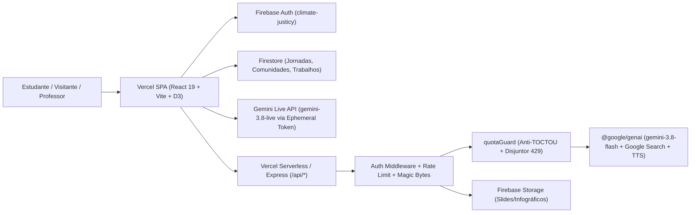

# 🗺️ C4_TOPOLOGY — Arquitetura Alvo (`justy_climatica`)

```mermaid
flowchart LR
    User["Estudante / Visitante / Professor"] --> VercelWeb["Vercel SPA (React 19 + Vite + D3)"]
    VercelWeb --> FirebaseAuth["Firebase Auth (climate-justicy)"]
    VercelWeb --> Firestore["Firestore (Jornadas, Comunidades, Trabalhos)"]
    VercelWeb --> GeminiLive["Gemini Live API (gemini-3.8-live via Ephemeral Token)"]
    VercelWeb --> VercelApi["Vercel Serverless / Express (/api/*)"]
    VercelApi --> Security["Auth Middleware + Rate Limit + Magic Bytes"]
    Security --> FinOps["quotaGuard (Anti-TOCTOU + Disjuntor 429)"]
    FinOps --> Gemini["@google/genai (gemini-3.8-flash + Google Search + TTS)"]
    Security --> Storage["Firebase Storage (Slides/Infográficos)"]
```
